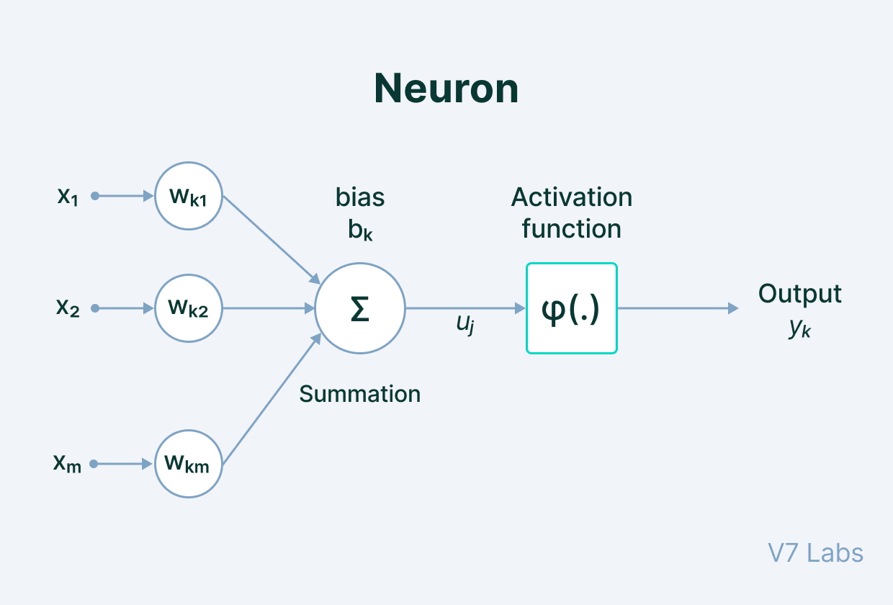

# Fundamentals of Machine Learning and Neural Networks

Welcome to the **Fundamentals of Machine Learning and Neural Networks** lecture. This document provides a comprehensive overview of key concepts, algorithms, and techniques essential for understanding and working with machine learning and neural networks at a graduate level.

---

## Table of Contents

1. [Introduction to Machine Learning](#1-introduction-to-machine-learning)
2. [Overview of Popular Machine Learning Algorithms](#2-overview-of-popular-machine-learning-algorithms)
3. [Neural Networks – From Perceptron to Deep Learning](#3-neural-networks--from-perceptron-to-deep-learning)
4. [Training Neural Networks and Optimization Techniques](#4-training-neural-networks-and-optimization-techniques)
5. [Feature Engineering and Data Preprocessing](#5-feature-engineering-and-data-preprocessing)
6. [Advanced Topics in Deep Learning](#6-advanced-topics-in-deep-learning)
7. [Conclusion](#7-conclusion)

---

## 1. Introduction to Machine Learning

Machine Learning (ML) is a subset of artificial intelligence that enables computers to learn from data and make decisions or predictions without being explicitly programmed for each task.

### Key Concepts

- **Data-Driven Approach**: ML models learn patterns from data.
- **Generalization**: The ability of a model to perform well on unseen data.
- **Model Capacity**: The complexity of a model and its ability to capture various functions.
- **Overfitting and Underfitting**: Balancing model complexity to avoid capturing noise or being too simplistic.

### Types of Machine Learning Tasks

1. **Supervised Learning**: Learning from labeled data.
   - **Classification**: Assigning inputs to predefined categories.
     - *Examples*: Email spam detection, image recognition.
   - **Regression**: Predicting continuous output values.
     - *Examples*: Predicting house prices, stock market forecasting.
2. **Unsupervised Learning**: Learning from unlabeled data.
   - **Clustering**: Grouping similar data points.
     - *Examples*: Customer segmentation.
   - **Dimensionality Reduction**: Reducing feature space while retaining information.
     - *Examples*: Data visualization.
3. **Reinforcement Learning**: Learning optimal actions through rewards and penalties.
   - *Examples*: Game playing (e.g., AlphaGo), robotics.

---

## 2. Overview of Popular Machine Learning Algorithms

### Linear Models

#### 1. Linear Regression

**Purpose**: Predicts a continuous dependent variable based on independent variables.

**Equation**:

$
y = \beta_0 + \beta_1 x_1 + \beta_2 x_2 + \dots + \beta_n x_n + \epsilon
$

**Assumptions**:

- Linearity
- Independence
- Homoscedasticity
- Normality

**Limitations**:

- Cannot capture non-linear relationships.
- Sensitive to outliers.

#### 2. Logistic Regression

**Purpose**: Used for binary classification tasks.

**Equation**:

$
P(y=1|x) = \frac{1}{1 + e^{-(\beta_0 + \beta_1 x_1 + \dots + \beta_n x_n)}}
$

**Assumptions**:

- Binary outcome.
- Independence of errors.
- Linearity in the log-odds.

**Limitations**:

- Cannot handle non-linear decision boundaries without feature engineering.

### Non-Linear Models

#### 3. Decision Trees

**Purpose**: Classification and regression.

**Structure**:

- Nodes represent features.
- Branches represent decision rules.
- Leaves represent outcomes.

**Advantages**:

- Easy to interpret.
- Handles numerical and categorical data.

**Limitations**:

- Prone to overfitting.
- Unstable with small data changes.

#### 4. Random Forests

**Purpose**: Ensemble method improving accuracy and controlling overfitting.

**Concepts**:

- **Bagging**: Training each tree on random subsets of data.
- **Feature Randomness**: Random subsets of features for splitting.

**Advantages**:

- Reduces variance.
- Handles large datasets.

**Limitations**:

- Less interpretable.
- Computationally intensive.

#### 5. Support Vector Machines (SVMs)

**Purpose**: Classification and regression with high-dimensional data.

**Concepts**:

- **Hyperplane**: Optimal decision boundary.
- **Support Vectors**: Data points closest to the hyperplane.
- **Margin**: Distance between hyperplane and support vectors.

**Kernel Trick**:

- Transforms data into higher dimensions to handle non-linearity.

**Advantages**:

- Effective in high-dimensional spaces.
- Memory efficient.

**Limitations**:

- Computationally intensive for large datasets.
- Requires careful tuning.

#### 6. K-Nearest Neighbors (KNN)

**Purpose**: Classification and regression based on proximity.

**Concept**:

- Assigns class based on majority among 'k' nearest neighbors.

**Advantages**:

- Simple implementation.
- No training phase.

**Limitations**:

- Computationally expensive during prediction.
- Sensitive to 'k' and feature scaling.

---

## 3. Neural Networks – From Perceptron to Deep Learning

### Introduction to Neural Networks

Neural Networks are computational models inspired by the human brain, consisting of layers of interconnected nodes (neurons).

### The Perceptron

**Developed by**: Frank Rosenblatt in 1957.

**Structure**: Single-layer neural network.

**Equation**:

$
y = f\left( \sum_{i=1}^n w_i x_i + b \right)
$

**Limitations**:

- Can only solve linearly separable problems.

### Multilayer Perceptrons (MLPs)

**Architecture**:

- **Input Layer**
- **Hidden Layers**
- **Output Layer**

**Activation Functions**:

- **Sigmoid**

  $
  f(x) = \frac{1}{1 + e^{-x}}
  $

- **Tanh**

  $
  f(x) = \tanh(x)
  $

- **ReLU**

  $
  f(x) = \max(0, x)
  $

**Universal Approximation Theorem**:

- MLPs can approximate any continuous function with sufficient neurons.

---

## 4. Training Neural Networks and Optimization Techniques

### Gradient Descent

**Purpose**: Minimizes the loss function by updating weights.

**Equation**:

$
w_{\text{new}} = w_{\text{old}} - \eta \frac{\partial L}{\partial w}
$

**Learning Rate ($\eta$)**:

- Controls step size.
- Must balance convergence speed and stability.png)

### Backpropagation

**Purpose**: Efficiently computes gradients for all weights.

**Process**:

1. **Forward Pass**: Compute outputs.
2. **Backward Pass**: Compute gradients using the chain rule.

**Equation**:

$
\frac{\partial L}{\partial w} = \frac{\partial L}{\partial a^{(l)}} \cdot \frac{\partial a^{(l)}}{\partial z^{(l)}} \cdot \frac{\partial z^{(l)}}{\partial w}
$

### Optimization Algorithms

#### 1. Momentum

- **Concept**: Accelerates gradient descent by considering past gradients.
- **Update Rule**:
  $
  v_t = \gamma v_{t-1} + \eta \frac{\partial L}{\partial w}
  $
  $
  w = w - v_t
  $

#### 2. RMSProp

- **Concept**: Adapts learning rate using a moving average of squared gradients.
- **Update Rule**:
  $
  E[\nabla w^2]_t = \beta E[\nabla w^2]_{t-1} + (1 - \beta) \left( \frac{\partial L}{\partial w} \right)^2
  $
  $
  w = w - \frac{\eta}{\sqrt{E[\nabla w^2]_t + \epsilon}} \frac{\partial L}{\partial w}
  $

#### 3. Adam

- **Concept**: Combines Momentum and RMSProp.
- **Update Rules**:
  - First moment estimate:
    $
    m_t = \beta_1 m_{t-1} + (1 - \beta_1) \frac{\partial L}{\partial w}
    $
  - Second moment estimate:
    $
    v_t = \beta_2 v_{t-1} + (1 - \beta_2) \left( \frac{\partial L}{\partial w} \right)^2
    $
  - Bias correction and parameter update:
    $
    \hat{m}_t = \frac{m_t}{1 - \beta_1^t}
    $
    $
    \hat{v}_t = \frac{v_t}{1 - \beta_2^t}
    $
    $
    w = w - \frac{\eta}{\sqrt{\hat{v}_t} + \epsilon} \hat{m}_t
    $

### Regularization Techniques

#### Overfitting

- **Definition**: Model performs well on training data but poorly on unseen data.
- **Detection**: High training accuracy, low validation accuracy.

#### Methods to Prevent Overfitting

1. **L1 Regularization**:

   - Adds absolute weight values to the loss function.
   - Encourages sparsity.

   $
   L_{\text{total}} = L_{\text{original}} + \lambda \sum |w|
   $

2. **L2 Regularization**:

   - Adds squared weight values to the loss function.
   - Encourages smaller weights.

   $
   L_{\text{total}} = L_{\text{original}} + \lambda \sum w^2
   $

3. **Dropout**:

   - Randomly drops neurons during training.
   - Reduces over-reliance on specific neurons.

4. **Early Stopping**:

   - Stops training when validation performance degrades.
   - Prevents learning noise.

#### Vanishing and Exploding Gradients

- **Vanishing Gradients**: Gradients become too small; slow learning.
- **Exploding Gradients**: Gradients become too large; unstable updates.
- **Solutions**:

  - Use ReLU activation functions.
  - Implement gradient clipping.
  - Use advanced architectures like LSTM.

---

## 5. Feature Engineering and Data Preprocessing

### Importance of Data Quality

- **Garbage In, Garbage Out**: Model performance depends on data quality.
- **Steps**:

  - Data Cleaning
  - Data Integration
  - Data Transformation

### Feature Scaling

#### Standardization (Z-score Normalization)

- **Formula**:
  $
  z = \frac{x - \mu}{\sigma}
  $

#### Normalization (Min-Max Scaling)

- **Formula**:
  $
  x_{\text{norm}} = \frac{x - x_{\text{min}}}{x_{\text{max}} - x_{\text{min}}}
  $

### Handling Missing Data

#### Deletion Methods

- **Listwise Deletion**: Remove records with missing values.
- **Pairwise Deletion**: Use all available data for analysis.

#### Imputation Methods

- **Mean/Median Imputation**
- **Model-Based Imputation**

### Encoding Categorical Variables

#### One-Hot Encoding

- Converts categories into binary vectors.

#### Label Encoding

- Assigns unique integers to categories.

#### Binary Encoding

- Reduces dimensionality compared to one-hot encoding.categorical_encoding_techniques.png)

---

## 6. Advanced Topics in Deep Learning

### Convolutional Neural Networks (CNNs)

**Purpose**: Specialized for grid-like data (e.g., ../images).

**Components**:

- **Convolutional Layers**
- **Pooling Layers**
- **Fully Connected Layers**

### Recurrent Neural Networks (RNNs)

**Purpose**: Designed for sequential data.

**Variants**:

- **LSTM (Long Short-Term Memory)**
- **GRU (Gated Recurrent Unit)**

### Variational Autoencoders (VAEs)

**Purpose**: Generative models learning probabilistic latent spaces.

**Structure**:

- **Encoder**: Outputs mean and variance.
- **Decoder**: Reconstructs data from latent distribution.

### Generative Adversarial Networks (GANs)

**Purpose**: Generative models for creating realistic data samples.

**Components**:

- **Generator**
- **Discriminator**

**Training Process**:

- **Adversarial Training**: Generator and discriminator compete.

---

Image credit: [V7 Labs](www.v7labs.com/resources)